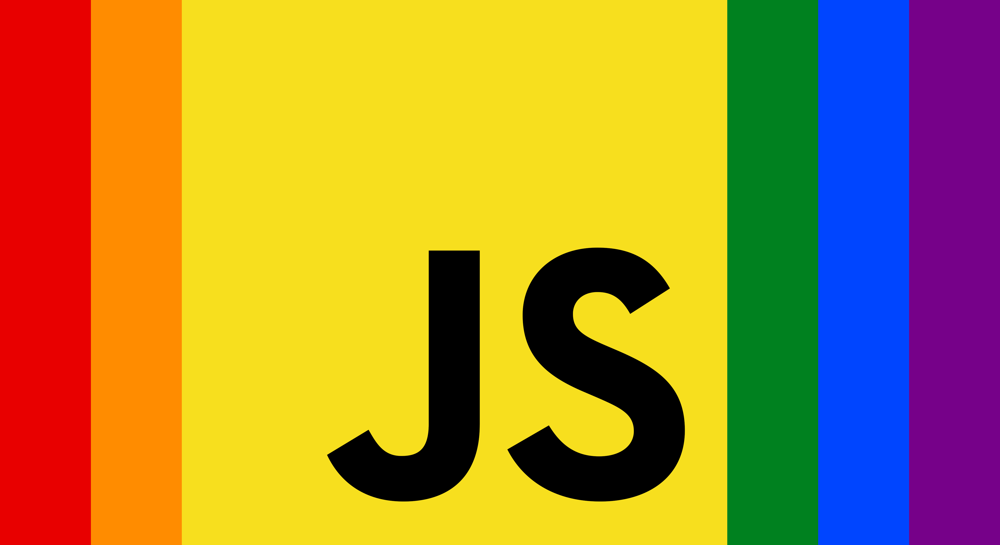

# Pride stickers

This repo hold the images for my pride stickers.
They are presented here under [MIT License](LICENSE)
which means that you may reproduce and print them as you see fit.

## JavaScript Pride

 
[[download]](https://github.com/donavon/pride-stickers/raw/master/javascript-pride.png)

The JavaScript Pride sticker (JS Pride) uses the RGB values from the
pride flag with the exception of the yellow, which is the standard
[JavaScript logo](https://github.com/voodootikigod/logo.js/) color.

| Color  | RGB value |
|--------|-----------|
| Red    | #e80000   |
| Orange | #ff8c00   |
| Yellow | #f3df49   |
| Green  | #00811f   |
| Blue   | #0045ff   |
| Violet | #760189   |

The width of the stripes are 1/6th the height. That gives an over-all logo proportion of 11:6.
Put another way, take the height of the logo, divide by 6, and multiply time 11 to get the width of the logo.

The "JS" uses the font "Neutra Text Bold" in black (i.e. #000000).
I find that sticker houses reproduce black better than the official logo color of #2e2e2c.

## Purchase this or other JavaScript stickers

I've made this sticker for sale at [JS Merch](https://jsmerch.dev) if you would like to order one.
There are also other JavaScript nerd stickers available for purchase on the site.

## License

[MIT License](LICENSE)
